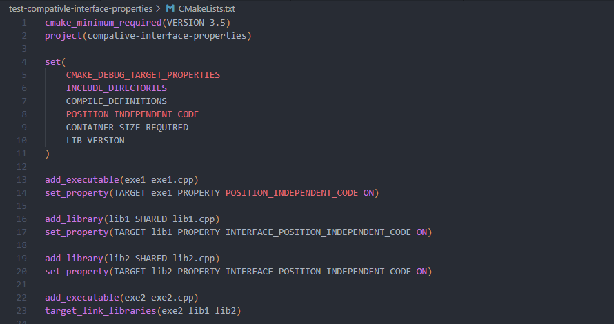
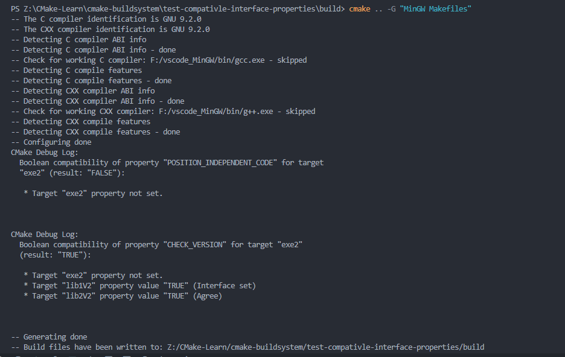
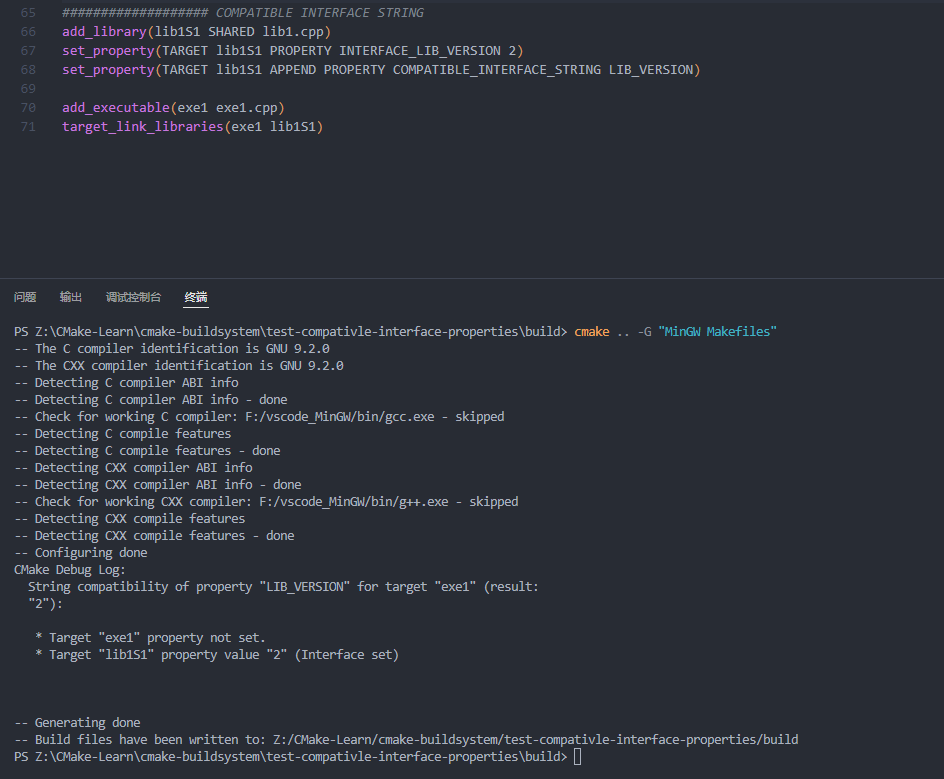

**Contents**
[toc]

#  cmake-buildsystem
##  Introduction
cmake构建系统是一种自上而下的设计方案。以target(可执行文件、库、用户自定义等)为操作目标，以命令和规则来对target进行生成限制。

##  Binary Targets
使用add_executable()和add_library()cmake命令来分别生成可执行文件和库文件。而实际生成的可执行文件和库文件将会根据相应的操作平台而带有特定平台的**前缀**和**后缀**以及相应的扩展。可以使用target_link_libraries()来设置target目标的依赖项。
```CMake{.lines-number}
add_library(archive archive.cpp zip.cpp lzma.cpp)
add_executable(zipapp zipapp.cpp)
target_link_libraries(zipapp archive)
```
说明：
首先使用archive.cpp、zip.cpp、lzma.cpp这些源文件编译的目标文件来生成库文件，然后使用zipapp.cpp文件来生成zipapp可执行文件。但是因为可执行文件是需要使用到archive库文件，所以需要在链接过程将库文件与zipapp文件组合成一个整体。

演示：
- MSVC


- gcc


###  Binary Executables
- 语法：
  add_executable(mytool mytool.cpp)

###  Binary Library Types
####  Normal Libraries
- 语法：
  使用add_library命令默认情况下会生成静态库，除非在使用命令时显式指明。
  - default
    add_library(archive STATIC archive.cpp zip.cpp lzma.cpp) == add_library(archive archive.cpp zip.cpp lzma.cpp)
  - specified
    add_library(archive SHARED archive.cpp zip.cpp lzma.cpp)
  - MODULE
    add_library(archive MODULE 7z.cpp)

- 注意：
  cmake还提供了**BUILD_SHARED_LIBS**变量用于在命令之外更改生成库的行为。库与其生成方式无关，库代表的是它与可执行文件之间的一种连接关系。特别需要说明的是，MODULE库类型的不同之处在于它通常也是不与可执行对象建立连接方式。也就是说，它不能存在于target_link_libraries()的右参数。因为它是作为一种新的插件技术在执行可执行文件之前被提前加载。同时还需要注意一点，如果库不导出任何符号表，该库只能是静态库；不能是动态库，因为动态库会生成一张符号表，以供连接时使用。

演示：
- MSVC
  - default staict library
    
    
    
  - shared library
    
    
    
  - KeyWord
    
    
    
- gcc
  pass

#####  Apple Frameworks
在cmake官方的介绍中，可以将一个动态库设置为**FRAMEWORK**属性来生成macOS或者IOS系统下的库架构包。根据Apple公司的统一习惯，还需要设置FRAMEWORK_VERSION参数，按照约定是设置为字符“A”；还有用于识别的一些符号(后缀？我也不清楚是什么，没用过IOS系统)
```cmake{.lines-number}
  add_library(MyFramework SHARED MyFramework.cpp)
  set_target_properties(
    MyFramework   PROPERTIES
    FRAMEWORK_VERSION   A # Version "A" is macOS convention
    MACOSX_FRAMEWORK_IDENTIFIER   org.cmake.MyFramework
  )
```
- 这儿为什么只是动态库需要这样设置呢？
  可能是在APPLE的系统上生成动态库了，但是在调用时需要满足APPLE系统的查找条件。静态库就没有这个问题，因为静态库不导出符号表，不需要调用程序与库之间建立动态连接。

###  Object Libraries
OBJECT库，个人理解应该是所给的源文件(.c/.cpp)通过编译器编译后生成的目标文件(.o)的一种库。但是在官方的解释中，还有一项重要的属性，非存档目标文件的集合(the object library type defines a non-archival collection of object file)。

*问题1：官方所指的non-archival是什么意思？*

目标文件的集合能作为源输入文件提供给其他的target目标，通过使用cmake的解释通式语法来使用。
```cmake{.lines-number}
add_library(archive OBJECT archive.cpp zip.cpp lzma.cpp)
add_library(archiveExtras STATIC $<TARGET_OBJECT:archive> extras.cpp)
add_executable(test_exe $<TARGET_OBJECT:archive> test.cpp)
```
其他target目标可能使用自身源文件(.c/.cpp)同时可以使用Object库来进行链接 ———— 省略了重复编译重复源文件的过程
```cmake{.lines-number}
add_library(archive OBJECT archive.cpp zip.cpp lzma.cpp)

add_library(archiveExtra STATIC extras.cpp)
target_link_libraries(
  archiveExtras 
  PUBLIC
  archive
)

add_executable(test_exe test.cpp)
target_link_libraries(test_exe archive)
```
上述cmake代码使用archive.cpp、zip.cpp、lzma.cpp通过编译器生成了archive.o、zip.o、lzma.o打包成了一个archive的OBJECT库。然后使用extras.cpp生成了archiveExtra的静态库,然后通过链接命令将OBJECT库链接到静态库中去。同时使用了该OBJECT与test.cpp生成了一个可执行文件。

*总结1：OBJECT库一般是用于有些模块或者代码会在整个工程中多次重复使用，这种情况下可以使用OBJECT库来减少重复编译的过程。*

*问题1解决：我是这样理解的，cmake只是把它们编译一遍，并且临时存储，使用时拷贝，cmake执行完毕后销毁*

演示：
- MSVC
  
  
- gcc
  
  
- 总结：
  OBJECT库既可以作为源文件用于生成target的组件，也可以作为链接的组件，并且能够重复使用。

##  Build Specification and Usage Requirements
**target_include_directories()、target_compile_definitions()、target_compile_options()**这三个命令指明了按什么规则(需要哪些头文件呀、需要添加哪些编译命令呀、需要哪些编译选项呀)来构建target目标以及生成二进制文件的makefile说明书。本质上来说，这些命令是用来填充下面的这些target属性的：INCLUDE_DIRECTORIES、COMPILE_DEFINITIONS、COMPILE_OPTION、INTERFACE_INCLUDE_DIRECTORIES、INTERFACE_COMPILE_DEFINITIONS、INTERFACE_COMPILE_OPTIONS。
上述的三个函数都有三种模式，分别是**PRIVATE**、**PUBLIC**和**INTERFACE**。 PRIVATE模式仅填充目标属性的非INTERFACE_变体，INTERFACE模式仅填充INTERFACE_变体。 PUBLIC模式填充各自目标属性的两个变体。它们都是在命令中通过关键字来激活使用的。

*我是这样理解的，对于每个target，cmake存储该target信息是设置了两个参数non-INTERFACE_variant和INTERFACE_variant,一旦你使用了PRIVATE参数target的non-INTERFACE_variant设置为true*
*append：*
  target                  --->      class
  private properties      --->      private
  public properties       --->      struct(默认全部开放)
  interface properties    --->      public

```cmake{.lines-number}
target_compile_definitions(
  archive
  PRIVATE   BUILDING_WITH_LZMA
  INTERFACE   USING_ARCHIVE_LIB
)
```
cmake建议使用命令来设置target目标的属性，而非直接写入特定的属性关键字。因为属性关键字可能会弄混。

猜想与验证：
- 猜想1：PUBLIC会发生继承
  现在我以FIRST宏编译archive库，然后使用PUBLIC链接main.exe。结果如下：
  - gcc
    
  猜想1总结：可以看出我只对archive库使用了编译宏定义，可是main.exe中却开启了FIRST宏定义，说明如果在编译中间库是PUBLIC，且目标是PUBLIC，目标将会继承中间库的编译选项。
- 猜想2：PRIVATE不会继承
  中间库使用PRIVATE，目标target使用PUBLIC
  - gcc
    
  猜想2总结，可以看到在main.exe中因为没有使用编译选项，所以打印的是默认的字符。而archive使用了FIRST编译选项，打印的是相应的first的内容。
- 猜想3：编译选项是可以覆盖的
  我现在使用FIRST编译archive，使用SECONDE编译main
  - gcc
    
  猜想3总结：可以看出虽然main是继承了archive库且archive也是PUBLIC状态，但是通过重写实现了编译选项的更改

总结：INTERFACE其实是介于PUBLIC与PRIVATE之间的一个选项，既不会全部开放自身的属性，也不会全部隐藏自己的属性。
    

###  Target Properties
一般只有在将源文件编译为二进制目标文件时，使用目标参数**INCLUDE_DIRECTORIES**、**COMPILER_DEFINITIONS**和**COMPILER_OPTIONS**。

INCLUDE_DIRECTORIES中出现的参数将会以-I或者-isystem的前缀的方式添加到编译行命令中去。

COMPILE_DEFINITIONS的条目解释是以前缀-D或者/D且顺序不定的方式添加到编译行命令当中去。其中DEFINE_SYMBOL目标参数可能作为对SHARED、MODULE库目标的快捷方式被添加到命令行，以一种编译命令的方式。

COMPILER_OPTIONS是来源于shell，按其属性值出现的顺序添加到编译命令行。

而INTERFACE_INCLUDE_DIRECTORIES、INTERFACE_COMPILE_DEFINITIONS和INTERFACE_COMPILE_OPTIONS对于设置target的编译属性是有语法要求的 ———— 对于使用这些的调用方，必须要保证编译和连接的正确性。对于任何二进制目标而言，使用target_link_libraries()命令中指定的每个目标的INTERFACE_属性会被使用。

```cmake{.line-numbers}
set(srcs archive.cpp zip.cpp)
if(LZMA_FOUND)
  list(APPEND srcs lzma.cpp)
endif()
add_library(archive SHARED ${srcs})
if(LZMA_FOUND)
  # The archive library sources are compiled with -DBUILDING_WITH_LZMA
  target_compile_definitions(archive PRIVATE BUILDING_WITH_LZMA)
endif()
target_compile_definitions(archive INTERFACE USING_ARCHIVE_LIB)

add_executable(consumer)
# Link consumer to archive and  consume its usage requirements. The consumer
# executable sources are compiled with -DUSING_ARCHIVE_LIB.
target_link_libraries(consumer archive)
```

一种很常见的现象是对于一个target，你可能不仅仅需要包括源文件夹，还需要包括相关的用于之前过程产生的生成文件夹中的文件，将这些文件路径都添加到INCLUDE_DIRECTORIES中去，此时CMAKE_INCLUDE_CURRENT_DIR关键字变量可以很好的将你需要的文件都添加到INCLUDE_DIRECTORIES属性中去。同理，变量CMAKE_INCLUDE_CURRENT_DIR_IN_INTERFACE能够方便的将文件添加给INTERFACE_INCLUDE_DIRECTORIES的所有target。这样就能通过将多重不同路径下的文件夹能够通过target_link_libraries()方便的设置。

- gcc
  

###  Transitive Usage Requirements
target目标的属性设置可以传递给依赖项。target_link_libraries()命令中存在PRIVATE、INTERFACE和PUBLIC三个关键字来控制依赖项与target之间的设置参数的传递。

```cmake{.line-numbers}
add_library(archive archive.cpp)
target_compile_definitions(archive INTERFACE USING_ARCHIVE_LIB)

add_library(serialization serialization.cpp)
target_compile_definitions(serialization INTERFACE USING_SERIALIZATION_LIB)

add_library(archiveExtras extras.cpp)
target_link_libraries(archiveExtras PUBLIC archive)

target_link_libraries(archiveExtras PRIVATE serialization)
# archiveExtras is compiled with -DUSING_ARCHIVE_LIB
# and -DUSING_SERIALIZATION_LIB

add_executable(consumer consumer.cpp)
# consumer is compiled with -DUSING_ARCHIVE_LIB
target_link_libraries(consumer archiveExtras)
```

~~对于archive库而言，使用了**INTERFACE**编译选型定义了USING_ARCHIVE_LIB宏，表明该宏不仅仅适用于archive静态库，同时该宏也是一个能够传递的参数，然后使用该archive静态库与archiveExtras建立了链接，但是它们之间的链接方式是PUBLIC(公开的)，~~
- MSVC
  
  
  
  
  
  
  
- 现象
  从结果来看，archive库和serialization库被编译时没有开启INTEFACE的宏定义，而archiveExtrea库却开启了对两个INTERFACE的宏定义。最后consumer只是开启了其中PUBLIC的宏定义。
- 结论
  这表明我之前的理解是错误的，INTERFACE并没有参与本次target对象的编译中去，而是通过链接被编译到了使用该target新生成的target中去了。这表明INTERFACE在仅仅是向上了一个接口以便被使用，但是本target是没有使用INTERFACE中的任何参数的。而对于新生成的archiveExtreas对象，两个参数通过链接被加入其编译选项中，然后主动将其中一个定义为了PUBLIC另一个定义为了PRIVATE，表明该target使用了这连个编译参数，并且对其中一个参数进行了公开，而另一个参数却选择了隐藏。此时consumer target在链接该库时，只使用了PUBLIC定义的相关参数。

- INTERFACE test
  - MSVC
    
  - 结论
    可以看到，如果我将所有的库的链接方式都使用INTERFACE，那么所有库包括可执行文件都没有使用相关的宏进行编译。这表明INTERFACE只是定义了一种交互的可能，如果在别的target中没有使用PUBLIC或者PRIVATE将它们转化为自己的属性，则不会采用INTERFACE中的参数来参与编译。
  - MSVC 验证
    
- PUBLIC test
  - MSVC
    
  - 结论
    可以看到，PUBLIC与INTERFACE的表现完全不同，INTERFACE不参与target对象的编译，只是传递参数；而PUBLIC不仅参与target对象的编译，同时还起到了传递参数的作用。PRIVATE参与本次target的编译，但是不参与参数的传递。

一般而言，如果你只在本库中使用该宏定义且该库的头文件中的调用与该宏定义完全无关，建议使用PRIVATE。这样做的好处是隐藏了库的实现的同时避免了宏污染，不然编译参数会在整个依赖项中进行传递，可能造成一些意想不到的错误。如果该库不仅仅使用到了相关定义进行编译，同时被第三方调用时其头文件也是依赖该宏定义的，这种情况下就应该使用PUBLIC关键字开放编译条件，这样使用第三方的头文件就不会有问题。如果一个库的实现没有使用到相关的宏定义，但是在一个总的调度同文件中需要该编译命令才能正确使用该库文件时，应该使用INTERFACE。
```cmake{.line-numbers}
target_link_libraries(
  archiveExtra
  PUBLIC    archive
  PRIVATE   serialization
)
```

如何实现传播的呢？~~cmake通过读取依赖项target中的target属性参数中具有INTERFACE_变体的参数，并且其值添加到当前target对象中的non-INTERFACE参数中去，来实现了PRIVATE。例如：依赖项的INTERFACE_INCLUDE_DIRECTORIES将被读取并且添加到操作对象的INCLUDE_DIRECTORIES中去。但是有些参数和顺序有关并且需要可维护，此时target_link_libraries()的参数可能不为被正确的编译，因为顺序原因。但是可以通过适当的命令来更新顺序。~~
cmake在链接时将读取被链接对象的INTERFACE参数(也就是target属性中带有INTERFACE_前缀的变体)，PUBLIC参数；如果此时是INTERFACE链接的，则当前主动链接方将只会读取target PUBLIC中的参数内容；如果此时是PUBLIC链接的，则当前调用方将会读取INTERFACE参数和PUBLIC参数。

- 链接与include的顺序
  - 顺序相同
    正常链接即可。
  - 顺序相反
    使用generator expression表达式来指明顺序
    如下面的例子，链接包的过程必须是lib1、lib2、lib3但是include包的过程必须是lib3、lib2、lib1.可以这样做
    ```cmake{.line-numbers}
    target_link_libraries(myExe lib1 lib2 lib3)
    target_include_directories(myExe
      PRIVATE   $<TARGET_PROPERTY:lib3,INTERFACE_INCLUDE_DIRECTORIES>
    )
    ```

###  Compatible Interface Properties
存在一些target在设计之初就被要求兼容其他的target或者是众多依赖项的性质。
例如，目标属性POSITION_INDEPENDENT_CODE可以用来指定一个布尔值，然后使用该布尔值来判断是否编译出独立于位置的target。同样的参数还有INTERFACE_INDEPENDENT_CODE。

- POSITION_INDEPENDENT_CODE
  是否创建一个位置独立的target目标，该target属性用于可执行文件或者是动态库，作用是这两个对象是否是位置独立的。

  在默认情况下，对于动态库和模块target，都是默认为True；其他的默认为False。如果在创建一个target之前，存在CMAKE_POSITION_INDEPENDENT_CODE变量，POSITION_INDEPENDENT_CODE将会被其初始化。

- INTERFACE_POSITION_INDEPENDENT_CODE
  使用者是否需要创建一个位置独立的target

  该参数用于通知使用方，并设置使用方的POSITION_INDEPENDENT_CODE的参数与该具有INTERFACE_POSITION_INDEPENDENT_CODE的target设置为相同参数。

```cmake{.line-numbers}
add_executable(exe1 exe1.cpp)
set_property(
  TARGET    exe1
  PROPERTY  POSITION_INDEPENDENT_CODE   ON
)

add_library(lib1 SHARED lib1.cpp)
set_property(
  TARGET      lib1
  PROPERTY    INTERFACE_POSITION_INDEPENDENT_CODE   ON
)

add_executable(exe2  exe2.cpp)
target_link_libraries(exe2  lib1)
```
从上述代码可以看出，对于exe1可执行文件，通过使用set_property函数主动设置了它的POSITION_INDEPENDENT_CODE为ON。
而对于lib1动态库文件，将其设置为了INTERFACE_POSITION_INDEPENDENT_CODE，但是对于可执行文件exe2，同样链接了该库文件，这样就会导致exe2可执行文件的POSITION_INDEPENDENT_CODE参数因为链接了lib1导致同样被设置为了ON。

- 演示
  - gcc
    
    
- 总结
  从上述可以看出，由于在生成动态库时将INTERFACE_POSITION_INDEPENDENT_CODE参数设置为了ON。并没有设置exe2的INTERFACE_POSITION_INDEPENDENT_CODE参数，但是cmake脚本运行的结果却是exe2继承了动态库的参数。这儿就有两个问题，1、我能在链接时将该参数关闭吗？2、如果链接的库存在不同的INTERFACE_POSITION_INDEPENDENT_CODE参数，其可执行文件最终的结果将会是什么样呢？

- 问题1测试
  - gcc
    
    
- 问题1结论
  可以看到，我将lib1中的参数设置为了ON，然后再exe1中设置为了OFF，编译器报错了。说明不能过链接后的参数进行显示的更改。

- 问题2测试
  - gcc
    
    
- 问题2结论
  可以看到，可执行文件中的参数由第一个动态库的参数决定了，但是又和第二个动态库的参数不匹配，从而cmake编译器发出了兼容性报错警告。


```cmake{.line-numbers}
add_library(lib1 SHARED lib1.cpp)
set_property(
  TARGET    lib1
  PROPERTY  INTERFACE_POSITION_INDEPENDENT_CODE     ON
)

add_library(lib2 SHARED lib2.cpp)
set_property(
  TARGET    lib2
  PROPERTY  INTERFACE_POSITION_INDEPENDENT_CODE     OFF
)

add_executable(exe1  exe1.cpp)
target_link_libraries(exe1 lib1)
set_property(
  TARGET    exe1
  PROPERTY  POSITION_INDEPENDENT_CODE     OFF
)

add_executable(exe2  exe2.cpp)
target_link_libraries(exe2  lib1  lib2)
```

~~上述代码存在两个问题：其中之一是对于exe1可执行文件而言，它链接了lib1动态库，可是生成动态库lib1时显式指明了该动态库的调用方的target属性为POSITION_INDEPENDENT_CODE，可是exe1被设置为了OFF，这儿就会产生冲突。其中之二是exe2可执行文件同时使用了lib1库和lib2库文件，它们连个文件一个要求调用方生成位置独立，一个要求调用方位置不独立。上述的冲突都会使CMake发出错误警告：~~
```cmake{.line-numbers}
CMake Error: The INTERFACE_POSITION_INDEPENDENT_CODE property of "lib2" does not agree with the value of POSITION_INDEPENDENT_CODE already determined for "exe2"
```
这样就存在一个问题：
所有使用方必须和使用的target具有同样的POSITION_INDEPENDENT_CODE属性。

有时兼容性的参数可能是由用户指定的，不一定是cmake中的特定bool关键字。如何实现将用户添加的属性设置为兼容性bool值呢？
使用set_property，指明对象，然后使用APPEND关键字来添加自定义属性，然后设置自定义参数为“兼容性接口bool值”，然后是该参数的名称。具体代码如下：
**set_property(TARGET xxx APPEND PROPERTY COMPATIBLE_INTERFACE_BOOL CUSTOMER_PROP)**
~~解决冲突的方法：~~
~~cmake可以通过使用COMPATIBLE_INTERFACE_BOOL目标属性中来扩展使用方的兼容方式。但是需要注意，每个使用方的属性必须和对应方的属性之间兼容。~~
```cmake{.line-numbers}
add_library(lib1Version2 SHARED lib1_v2.cpp)
set_property(
  TARGET    lib1Version2
  PROPERTY  INTERFACE_CUSTOM_PROP   ON
)
set_property(
  TARGET    libVersion2
  APPEND    PROPERTY    COMPATIBLE_INTERFACE_BOOL   CUSTOM_PROP
)

add_library(lib1Version3  SHARED  lib1_v3.cpp)
set_property(
  TARGET      libVersion3
  PROPERTY    INTERFACE_CUSTOM_PROP  OFF
)

add_executable(exe1  exe1.cpp)
target_link_libraries(exe1  lib1Version2)   # CUSTOM_PROP  will be ON

add_executable(exe2  exe2.cpp)
target_link_libraries(exe2  lib1Version2  lib1Version3)   # Diagnostic
```

- 用户自定义bool演示
  - gcc
    
  - 结论
    可以看到cmakeDEBUG的结果，打印出了*Boolean compatibility of property “LIB_TEST_USER” for target “exe1”*
  
- 多对象兼容性演示
  - gcc
    
  - 结论
    可以看到DEBUG详细显示，同样自定义兼容性bool值起到了传递和验证的作用；同时可以看到，我只是为lib1增添了一个属性，同时却在lib2中其作用了。

- 兼容性与顺序是否有关演示
  - gcc
    
  - 结论
    **COMPATBLE_INTERFACE_BOOL**值与链接的顺序无关。

- BOOL与定义
  - gcc
    
  - 结论
    可以看到，如果没有定义COMPATIBLE_INTERFACE_BOOL值的话，就算你添加了也是起作用的。

从上述代码可以看出，lib1Version2动态库使用set_property命令打开了INTERFACE_CUSTOM_PROP(用户属性兼容接口)，然后又通过set_property命令来添加了接口兼容的COMPATIBLE_INTERFACE_BOOL，并且使用了CUSTOM_PROP参数。
对于exe1target可以看出，其POSITON_INDEPENDENT_CODE应该是被设置为OFF，而lib1Version2库是一个动态库，其POSITON_INDEPENDENT_CODE应该是ON，此时通过扩展了兼容属性，CUSTOM_PROP将会被设置为ON，表示兼容ON与OFF所产生的冲突。
所以对于exe2target对象而言，关闭了其接口兼容，此时一个为ON，一个为OFF当然后产生Cmake错误。

使用上述的兼容接口布尔值并不是唯一的解决方案。还可以使用**COMPATIBLE_INTERFACE_STRING**属性来到达兼容的效果。COMPATIBLE_INTERFACE_STRING属性中指定的属性必须是未指定的或与所有传递指定的依赖项中的字符串进行比较。该方法对于确保库兼容不同版本的链接方式是非常有用的。
```cmake{.line-numbers}
add_library(lib1Version2  SHARED  lib1_v2.cpp)
set_property(
  TARGET  lib1Version2  
  PROPERTY  INTERFACE_LIB_VERSION  2
)
set_property(
  TARGET  lib1Version2
  APPEND  PROPERTY  COMPATIBLE_INTERFACE_STRING  LIB_VERSION
)

add_library(lib1Version3  SHARED  lib1_v3.cpp)
set_property(
  TARGET  lib1Version3
  PROPERTY  INTERFACE_LIB_VERSION  3
)

add_executable(exe1  exe1.cpp)
target_link_libraries(exe1  lib1Version2)  #  LIB_VERSION will be "2"

add_executable(exe2  exe2.cpp)
target_link_libraries(exe2  lib1Version2  lib1Version3)  #  Diagnostic
```

- 兼容接口字符串演示
  - gcc
    
  - 结论
    可以看出，成功为target对象添加了LIB_VERSION属性

  - gcc
    
  - 结论
    如果使用了兼容字符串，但是连接时如果字符串不兼容，编译器同样会报错

对于lib1Version2而言，对其添加了LIB_VERSION字符串，然后将该字符串通过COMPATIBLE_INTERFACE_STRING设置为了兼容字符串。所以对于可执行文件exe1来说，它与target属性将会被设置为2。此时如果同时对于可执行文件exe2链接了lib1Version2和lib1Version3，此时它们两个库的LIB_VERSION将会发生冲突。

如何解决这样的冲突呢？通常，我们对于存在同一个库的多个版本的链接，要么是选择版本最高的库要么是选择版本最低的库。可以通过COMPATIBLE_INTERFACE_NUMBER_MAX/MIN参数来设置。
```cmake{.line-numbers}
add_library(lib1Version2 SHARED lib1_v2.cpp)
set_property(
  TARGET  lib1Version2
  PROPERTY  INTERFACE_CONTAINER_SIZE_REQUIRED  200
)
set_property(
  TARGET  lib1Version2
  APPEND  PROPERTY  COMPATIBLE_INTERFACE_NUMBER_MAX  CONTAINER_SIZE_REQUIRED
)

add_library(lib1Version3  SHARED  lib1_v3.cpp)
set_property(
  TARGET  lib1Version3
  PROPERTY  INTERFACE_CONTAINER_SIZE_REQUIRED  1000
)

add_executable(exe1  exe1.cpp)
#  CONTAINER_SIZE_REQUIRED  will be "200"

add_executable(exe2 exe2.cpp)
#  CONTAINER_SIZE_REQUIRED will be "1000"
target_link_libraries(exe2  lib1Version2  lib1Version3)
```
从上述可以看出，对于只存在单个库lib1Version2的exe1可执行文件而言，由于存在COMPATIBLE_INTERFACE_SIZE_REQUIRED将会被设置为200；但是如果存在多个库，他将会按最大的参数来链接指定的库。

- COMPATIBLE_INTERFACE_NUMBER_MAX/MIN演示
  - gcc
  


###  Property Origin Debugging
使用cmake来创建项目时，脚本的执行成功与否很大程度上取决于代码是否正确、依赖项是否正确以及cmake脚本代码是否正确。者众多的因素导致当脚本出错时，很难判断是那一部分出错了。可以使用**CMAKE_DEBUG_TARGET_PROPERTY**变量来打印出target的编译信息。

```cmake{.line-numbers}
set(
  CMAKE_DEBUG_TARGET_PROPERTIES
  INCLUDE_DIRECTORIES
  COMPILE_DEFINITIONS
  POSITION_INDEPENDENT_CODE
  CONTAINER_SIZE_REQUIRED
  LIB_VERSION
)
add_executable(exe1  exe1.cpp)
```
对于关键字COMPATIBLE_INTERFACE_BOOL和COMPATIBLE_INTERFACE_STRING，debug将会打印该兼容性是由哪一个依赖项传递给target的，并且还将显示其他的target是否也依赖该兼容性接口。而对于COMPATIBLE_INTERFACE_NUMBER_MAX和COMPATIBLE_INTERFACE_NUMBER_MIN参数，debug将会打印每个依赖项的的参数。


###  Build Specification with Generator Expressions
~~一个项目的生成手册可能需要使用到**generator expressions**，它能够处理cmake构建时的条件以及一些已知内容。例如，读取兼容性参数时可以使用TARGET_PROPERTY表达式。~~
项目的生成说明书(因为CMake会先生成Makefile————Makefile相当于项目的生成说明书)中可能使用到一些特殊的条件或者是只有在CMake运行时才能知道的内容，对于这种情况可以使用生成表达式来使用这种情况。例如，在计算兼容性值的属性时可能需要读取target属性的表达式：

```cmake{.line-numbers}
add_library(lib1Version2 SHARED lib1_v2.cpp)

# 为lib1Version2添加了一个名为CONTAINER_SIZE_REQUIRED的参数，并且设置为了200
set_property(
  TARGET  lib1Version2
  PROPERTY  INTERFACE_CONTAINER_SIZE_REQUIRED  200
)

# 将CONTAINER_SIZE_REQUIRED参数设置为了COMPATIBLE_INTERFACE_NUMBER_MAX
set_property(
  TARGET  lib1Version2
  APPEND PROPERTY COMPATIBLE_INTERFACE_NUMBER_MAX  CONTAINER_SIZE_REQUIRED
)


add_executable(exe1  exe1.cpp)
target_link_libraries(exe1  lib1Version2)
target_compile_definitions(exe1
  PRIVATE  CONTAINER_SIZE=$<TARGET_PROPERTY:CONTAINER_SIZE_REQUIRED>
)
```
上面的CMake为lib1Version2增加了COMPATIBLE_INTERFACE_NUMBER_MAX属性，并且设置名称为CONTAINER_SIZE_REQUIRED。在与exe1进行链接时这些属性都将会传递给exe1。此时却使用了该属性来编译exe1，要获取属性的值时，使用到了generator expression表达式。

一元的TARGET_PROPERTY、TARGET_POLICY生成表达式通过调用该方法的TARGET来计算相应的值，这就表明生成的构建说明书将基于不同的target的调用者得到不同的值。

```cmake{.line-numbers}
add_library(lib1 lib1.cpp)
target_compile_definitions(lib1 INTERFACE
  $<$<STREQUAL:$<TARGET_PROPERTY:TYPE>,EXECUTABLE>:LIB1_WITH_EXE>
  $<$<STREQUAL:$<TARGET_PROPERTY:TYPE>,SHARED_LIBRARY>:LIB1_WITH_SHARED_LIB>
  $<$<TARGET_POLICY:CMP0041>:CONSUMER_CMP0041_NEW>
)

add_executable(exe1 exe1.cpp)
target_link_libraries(exe1 lib1)

cmake_policy(SET CMP0041 NEW)

add_library(shared_lib shared_lib.cpp)
target_link_libraries(shared_lib lib1)
```
上述cmake中，lib1中使用了INTERFACE的generator expression。由于可执行文件链接到了lib1，exe1将会接受INTERFACE中的属性(因为没有特别指明——表示是以PUBLIC的方式进行链接的)，此时generator expression将会生效。因为exe1是一个可执行文件，以-DLIB1_WITH_EXE的编译选项来编译exe1可执行文件。
~~又由于shared_lib中同样链接了lib1库，且shared_lib是使用~~此处shared_lib明明是静态库，可是为什么官方文档说是动态库

- demostration
  - MSVC
  
  - summary
    可以看到，实际cmake编译出的结果与我想象的一样，因为shared_lib是没有使用SHARED关键字，所以是没有-DLIB1_WITH_SHARED_LIB编译选项的。但是值得注意的一点是，我是在可执行文件代码后面设置的cmake_policy，但实际上他却全局生效了。


- 补充知识————export
  出口targets或者是packages以便外部的项目可以在当前的构成树中直接使用它们，而不需要安装命令。
  更加相依的资料可以看install(EXPORT)命令来从安装树中出口targets。

  - 语法
  ```cmake{.line-numbers}
    export(TARGETS <target>... [...])
    export(EXPORT <export-name> [...])
    export(PACKAGE <PackageName>)
  ```
  从上面可以看出，可以对外出口target、export、package。

  - Exporting Targets
    ```cmake{.line-numbers}
    export(TARGETS <target>... [NAMESPACE <namespace>]
           [APPEND] FILE <filename> [EXPORT_LINK_INTERFACE_LIBRARIES])
    ```
    该命令会创建一个**filename**,外部项目可以通过该**filename**来获取**target...**中的所有构建树参数。这在交叉编译中非常有用，可以在主平台中编译然后在实际的嵌入式环境中通过引用还直接使用该可执行文件，或者是获取该可执行文件的构造参数之类的。
    该命令生成的文件只适用于构造树(build tree)，并且绝对不能通过install(EXPORT)命令在安装树(install tree)中使用。

    - argument
      - NAMESPACE <namespace>
        在export生成的文件中写入时，需要指明target的namespace
      - APPEND
        向已有文件中添加而不是覆盖掉build tree文件。可以在同一个export文件中新增多个子CMakeLists生成的target
      - EXPORT_LINK_INTERFACE_LIBRARIES
        包含以模式命名的属性内容
    使用这个语句时，所有的target必须被显式的列出，如果你出口了一个相关的库，但是该库的链接相关依赖项没有被出口，此时使用方使用了该命令，后果是不可知的。
  
  - Exporting Targets matching install(EXPORT)
    ```cmake{.line-numbers}
    export(EXPORT <export-name> [NAMESPACE <namespace>] [FILE <filename>])
    ```
    创建一个filename的文件，外部cmake项目可以使用该filename名称来引入当前项目的生成树。与export(TARGETS)一样，但是值得注意的一点是使用该命令的target不会被显式的列出像export(TARGETS)一样。相反，该命令能够导出与安装export相关联的target。可以在install(TARGETS)命令中使用export导出相关的安装项，然后使用export命令来导出。

  - Exporting Package
    ```cmake{.line-numbers}
    export(PACKAGE <PackageName>)
    ```
    将当前构建目录存储在包<PackageName>的CMake用户包注册表中。然后可以使用find_package()命令来通过包名来找到该包文件。这将帮助依赖项项目找到并且使用当前文件生成树中产生的包文件。包文件与安装树文件生成文件是一起作用的。

*BUILD_INTERFACE*表达式只有在cmake --build .命令被输入时起作用(我的理解)、或者是在cmake中使用了export关键字时生效。而*INSTALL_INTERFACE*表达式只有在使用了cmake --install .命令后生效
```cmake{.line-numbers}
add_library(ClimbingStats climbingstats.cpp)
target_compile_definitions(ClimbingStats INTERFACE
  $<BUILD_INTERFACE:ClimbingStats_FROM_BUILD_LOCATION>
  $<INSTALL_INTERFACE:ClimbingStats_FROM_INSTALLED_LOCATION>
)

install(TARGETS ClimbingStats EXPORT libExport ${InstallArgs})
install(EXPORT libExport NAMESPACE Upstream::
        DESTINATION lib/cmake/ClimbingStats)
export(EXPORT libExport NAMESPACE Upstream::)

add_executable(exe1 exe1.cpp)
target_link_libraries(exe1 ClimbingStats)
```
在上面的例子中，exe1可执行文件将会和-DClimbingStats_FROM_BUILD_LOCATION一起被编译。

- demostration
  - gcc
    
  - summary
    可以看出export导出的文件是带有.cmake后缀的相关target的配置文件。而安装文件才是实际的target文件
    
一般按照约定export的文件目录如下


####  Include Directories and Usage Requirements
在使用明确语法与生成表达式的头文件引用中，需要特别注意。第一点、因为target_include_directories()命令接受相对路径和绝对路径，如下所示：
```cmake{.line-numbers}
add_library(lib1 lib1.cpp)
target_include_directories(lib1 PRIVATE
    /absolute/path
    relative/path
)
```
相对路径是相对于出现该命令的源文件夹而言。注意对于IMPORTED target的头文件引用不能使用相对路径。
为了使用更加简洁的命令代码，**INSTALL_PREFIX**表达式被使用在了安装接口参数中。它是一个扩展的替代符，在被项目使用时将会被替换成为安装路径。

一般来说，对于生成树和安装树，它们的引用文件夹是不同的。所以**BUILD_INTERFACE**和**INSTALL_INTERFACE**能够用来处理路径，语法要求不同的情况。同样可以在**INSTALL_INTERFACE**中使用相对路径，但是其相对路径的前缀将不再被解释为相对于命令出现的文件夹，而是相对于安装前缀。例如：
```cmake{.line-numbers}
add_library(ClimbinStats climbingstats.cpp)
target_include_directories(ClimbingStats INTERFACE
    $<BUILD_INTERFACE:${CMAKE_CURRENT_BINARY_DIR}/generated>
    $<INSTALL_INTERFACE:/absolute/path>
    $<INSTALL_INTERFACE:relative/path>
    $<INSTALL_INTERFACE:$<INSTALL_PREFIX>/$<CONFIG>/generated>
)
```
cmake提供了两个关键字，能够方便的在包含头文件中使用。*CMAKE_INCLUDE_CURRENT_DIR_IN_INTERFACE*其效果如下
```cmake{.line-numbers}
set_property(TARGET tgt APPEND PROPERTY INTERFACE_INCLUDE_DIRECTORIES
    $<BUILD_INTERFACE:${CMAKE_CURRENT_SOURCE_DIR};${CMAKE_CURRENT_BINARY_DIR}>
)
```
对于每一个使用了generator表达式的target，安装命令变得更加方便使用了：
```cmake{.line-numbers}
install(TARGETS foo bar bat EXPORT tgts ${dest_args}
    INCLUDES DESTINATION include
)
install(EXPORT tgts ${other_args})
install(FILES ${headers} DESTINATION include)
```
上述代码等同于添加“${CMAKE_INSTALL_PREFIX}/include”参数赋值给每个安装target对象的**INTERFACE_INCLUDE_DIRECTORIES**参数中去。


###  Link Libraries and Generator Expressions
在链接库时，同样可以使用*generator expression*。然而链接方通过调用被链接方来实现链接，就存在一个额外的限制**被链接的target不能形成一个有向无环图**(也就是说不能A->B->C->A)。也就是说，如果链接到目标依赖于目标属性的值，那么目标属性可能不依赖于链接的依赖项:(???)
```cmake{.line-numbers}
add_library(lib1 lib1.cpp)
add_library(lib2 lib2.cpp)
target_link_libraries(lib1 PUBLIC
    $<$<TARGET_PROPERTY:POSITION_INDEPENDENT_CODE>:lib2>
)

add_library(lib3 lib3.cpp)
set_property(TARGET lib3 PROPERTY INTERFACE_POSITION_INDEPENDENT_CODE ON)

add_executable(exe1 exe1.cpp)
target_link_libraries(exe1 lib1 lib3)
```


###  Output Artifacts
使用**add_library()**和**add_executable()**命令创建的target构建规则生成的*buildsystem target*将会在**cmake --build .**或者是*make*阶段将会产生二进制的输出。如果想准确定位二进制文件的输出，必须使用*generator exprssion*表达式来描述位置。因为生成位置依赖于target的生成配置和被链接依赖项的连接语言等**TARGET_FILE**,**TARGET_LINKER_FILE**以及相关的表达式能够用来访问和定位生成的二进制文件。但是这些表达式对于OBJECT库并不起作用，因为上述的描述对象不包括OBJECT库文件。
存在三种方式来使用手动输出。这三种方式根据是否是DLL平台而存在不同的行为。所有的基于windows系统的包括Cygwin都是DLL平台。

####  Runtime Output Artifacts
适用于运行时的手动输出：
- 使用add_executable()命令生成的可执行文件(.exe或者是.a文件)
- 在DLL平台下：使用add_library()命令且SHARED选项被开启的动态库对象(.dll文件)
**RUNTIME_OUTPUT_DIRECTORY**和**RUNTIME_OUTPUT_NAME**对象属性能够被用来在生成树中控制运行时手动输出的位置和名称

####  Library Output Artifacts
适用于库的手动输出：
- 使用add_library()命令生成的且使用**MODULE**显示开启的能够被导入的模块库对象(.dll或者.so文件)
- 非DLL平台：使用add_library()命令且带有SHARED关键字的动态库对象(.so或者.dylib文件)
上述能够使用**LIBRARY_OUTPUT_DIRECTORY**和**LIBRARY_OUTPUT_NAME**对象属性能够在生成树中用来控制库的手动输出和命名。

####  Archive Output Artifacts
适用于档案对象的手动输出：
- 使用add_library()命令且STATIC关键字生成的静态库对象(.lib和.a文件)
- DLL平台：由add_library()命令和shared选项创建的共享库目标的导入库文件(例如.lib)。只有当库导出至少一个非托管符号时，才保证此文件存在
- DLL平台：一个使用add_executable()命令生成的可执行对象，且该对象的ENABLE_EXPORTS属性被设置时的导入库文件。
- AIX平台：一个使用add_executable()命令生成的且ENABLE_EXPORTS属性被设置的连接导入文件。
**ARCHIVE_OUTPUT_DIRECTORY**和**ARCHIVE_OUTPUT_NAME**对象属性能够用来管理生成树中的上述文件的定位和名称。

###  Directory-Scoped Commands
命令**target_include_directories()**,**target_compile_definitions()**和**target_compile_option()**命令，在命令的执行期间只能作用于一个target。**add_compile_definitions()**,**add_compile_option()**和**include_directories()**具有上述命令同样的功能，但是不同的是这些命令具有文件作用域，能够更加方便的在文件中使用。

##  Build Configurations
配置为不同类型的构建(Release或Debug)确定构建规范。而配置信息又由**generator**表达式所决定。对于想Makefile Generators和Ninja这样的单配置生成器，配置在配置时间通过CMAKE_BUILD_TYPE变量来明确指出。对于像Visual Studio、Xcode和Ninga Multi-Config这样的多配置生成器，配置将会在build期间被选择使用，而配置期间的CMAKE_BUILD_TYPE变量将会被忽略。对于多配置事件，可以使用**CMAKE_CONFIGURATION_TYPES**变量在配置期间来指明build的可配置参数，但是实际的配置信息在build之前都是未知的。下述的CMake脚本通常导致误解和潜在的错误代码：
```cmake{.line-numbers}
# WARNING:  This is wrong for muti-config generators because they don't use and typically don't even set CMAKE_BUILD_TYPE
string(TOLOWER ${CMAKE_BUILD_TYPE} build_type)
if(build_type STREQUAL debug)
    target_compile_definitions(exe1 PRIVATE DEBUG_BUILD)
endif()
```
- reason
  原因是上述代码对于多配置生成器而言，永远不会生成带有DEBUG_BUILD编译命令的debug项目。因为多配置生成器不使用关键变量CMAKE_BUILD_TYPE
上述问题可以使用生成表达式来替换，是脚本对于任何生成器都能到达同样的效果。
```cmake{.line-numbers}
# Works correctly for both single and multi-config generators
target_compile_definitions(exe1 PRIVATE
    $<$<CONFIG:Debug>:DEBUG_BUILD>
)
```
上述生成表达式语句同样适用于*IMPORTED*target

这儿说一句：因为我的电脑环境中存在太多的编译器了，连MSVC都有好几个。以前使用CMake是总是在CMake ..时使用CMAKE_BUILD_TYPE=Debug。有一次生成的项目死活不然调试，搞得我还以为Visual Studio出问题了。

###  Case Sensitivity
*CMAKE_BUILD_TYPE*和*CMAKE_CONFIGURATION_TYPES*像其他字符串变量一样，可以通过STREQUAL来进行比较时，是字符串大小写敏感的。$< CONFIG>生成器表达式还保留由用户或CMake默认设置的配置大小写。例如:
```cmake{.line-numbers}
# NOTE: Don't use these patterns, they are for illustration purposes only.
set(CMAKE_BUILD_TYPE Debug)
if(CMAKE_BUILD_TYPE STREQUAL DEBUG)
    # ... will never get here, "Debug" != "DEBUG"
endif()

add_custom_target(print_config ALL
    #   Prints "Config is Debug" in this single-config case
    COMMAND ${CMAKE_COMMAND} -D echo "Config is $<CONFIG>"
    VERBATIM
)

set(CMAKE_CONFIGURATION_TYPES Debug Release)
if(DEBUG IN_LIST CMAKE_CONFIGURATION_TYPES)
    # ... will never get here, "Debug" != "DEBUG"
endif()
```
相比之下，CMake在内部根据配置修改行为的地方使用配置类型时不区分大小写。例如：在$< CONFIG:Debug>生成表达式中，Debug、DEBUG、debug或者是DEbug都能让该表达式计算出1的结果。因此，在使用CMAKE_BUILD_TYPE或者CMAKE_CONFIGURATION_TYPES的表达式语句中，无论大小写都行。但是在字符串比较中，最好先将字符串统一转换为大写或小写，然后再比较。

###  Default And Custom Configurations
在默认情况下，CMAKE定义了下述的标准配置
- Debug
- Release
- RelWithDebInfo
- MinSizeRel

在多配置生成器中，**CMAKE_CONFIGURATION_TYPES**将会使用上述标准配置列表中的某一项进行填充，除非项目生成TYPES被写死或者用户改写了值。一般变量的实际值在build期间发生传递和改写。(也就是说，你在cmake中，或者配置过程中分别给CMAKE_CONFIGURATION_TYPES不同的值，最后只有build时的值是有效的，其他都会被覆盖)
对于但配置生成器而言，CMAKE_BUILD_TYPE变量必须在配置期间被指明，并且此后将不受更改。并且默认配置信息将会被置为none，并且被一个空字符串替代。一个普遍的误解是以为它的表现形式与Debug是类似的，实际上是不对的。用于应该显示指定来避免普通的问题。

上述的四种标准配置关键字在大多数的平台都是能够被解释的(也就是说：一般来说是能够被识别的)，但是同样可能在上述四种的情况下进行额外的类型扩展。每个配置都为所使用的语言定义了一组编译器和链接器标志变量。这些变量遵循惯例CMAKE_< LANG>_ FLAGS_< CONFIG>，其中< CONFIG>总是大写的配置名称。在定义自定义配置类型时，确保适当地设置了这些变量，通常是缓存变量

##  Pseudo Targets
有时设置了目标的类型并不表示该目标在构建系统中的输出类型，而例如外部输入项、其他的非人工的构建项等输入的类型是确定的。生成的构建系统中不存在*假*target。

###  Imported Targets
一个被引用的target通常都是一个已经存在了的target。通常这样的target被定义为整个项目的上游包并且应默认它是不可更改的。在引入target之后，可以使用用户命令函数如**target_include_directories()，target_compile_option()，target_link_libraries()**向普通的target一样来设置外部引用target的属性。导入的target同样具有普通二进制targets一样的**INTERFACE_INCLUDE_DIRECTORIES,INTERFACE_COMPILE_DEFINITIONS,INTERFACE_LINK_LIBRARIES,and INTERFACE_POSITION_INDEPENDENT_CODE**。
同样可可以读取导入target的**LOCATION**，但是一般不会这样做。而像**add_custom_command()**的命令可以很容易将导入的可执行文件执行。
引入target的作用范围是它被定义的CMake脚本中。它可以被下一级的子文件中CMake使用，但是不能被父级CMake和同级CMake脚本中使用。这一点与CMake脚本中的变量类似。

###  Alias Targets
ALIAS目标是在只读上下文中可以与二进制目标名称互换使用的名称。ALIAS对象常用在例子、库的伴生单元测试可执行文件，这些都是同一构建系统的一部分或者是基于用户而生成的单独配置。
```cmake{.line-numbers}
add_library(lib1 lib1.cpp)
install(TARGETS lib1 EXPORT lib1Export ${dest_args})
install(EXPORT lib1Export NAMESPACE Upstream:: ${other_args})

add_library(Upstream::lib1 ALIAS lib1)
```
通过上述代码我们可以知道，我们在其他的库中使用Upstream::lib1来与该库进行链接，同时也可以使用ALIAS语句来对该库进行重命名后再链接使用。
```cmake{.line-numbers}
if(NOT TARGET Upstream::lib1)
    find_package(lib1 REQUIRED)
endif()
add_executable(exe1 exe1.cpp)
target_link_libraries(exe1 Upstream::lib1)
```
ALIAS对象一旦在一个cmake脚本中定义，它就是不能更改的、不可安装的同时可是不能导出的target。它完完全全是只存在于本地的构建系统中的脚本中。可以通过**ALIASED_TARGET**属性来判断一个target是否是ALIAS对象
```cmake{.line-numbers}
get_target_property(_aliased Upstream::lib1 ALIASED_TARGET)
if(_aliased)
    message(STATUS "The name Upstream::lib1 is an ALIAS for ${_aliased}.")
endif()
```
可以使用get_target_property()和关键字**ALIASED_TARGET**参数来进行判断。

###  Interface Libraries
一个INTERFACE库对象不会对库文件的源码进行编译同时不会实际存在于磁盘上的库文件，所以说INTERFACE库没有**LOACTION**。
同样一个INTERFACE库文件也可以通过**INTERFACE_INCLUDE_DIRECTORIES，INTERFACE_COMPILE_DEFINITIONS，INTERFACE_COMPILE_OPTIONS，INTERFACE_LINK_LIBRARIES，INTERFACE_POSITION_INDEPENDENT_CODE**等关键字来设置INTERFACE库的属性。只用在INTERFACE模式下，**target_include_directories()，target_compile_definitons()，target_compile_options()，target_sources()，和target_link_libraries()**命令才能被使用。
自从CMake3.19以来，一个INTERFACE库文件能够选择性的包含源文件。而包含源文件的INTERFACE库将会被添加到构建系统的生成树当中去。虽然它不编译任何源文件，但是可以使用用户命令函数来生成其他的源。此外，ide将把源文件作为目标的一部分显示，以便进行交互式读取和编辑。
INTERFACE库的最主要用途是都是头文件的库文件。
```cmake{.line-numbers}
add_library(Eigen INTERFACE
    src/eigen.h
    src/vector.h
    src/matrix.h
)
target_include_directories(Eigen INTERFACE
    $<BUILD_INTERFACE:${CMAKE_CURRENT_SOURCE_DIR}/src>
    $<INSTALL_INTERFACE:include/Eigen>
)

add_executable(exe1 exe1.cpp)
target_link_libraries(exe1 Eigen)
```
上述代码使**Eigen**库文件被生成和安装在特定的位置，但是该库在链接时并没有什么特别的影响。它只是绑定了一个exe1文件target用于构建和生成在特定的位置。

INTERFACE库可以被安装和出口。但是它们必须分开被安装。
```cmake{.line-numbers}
set(Eigen_headers
    src/eigen.h
    src/vector.h
    src/matrix.h
)

add_library(Eigen INTERFACE ${Eigen_headers})
target_include_directories(Eigen INTERFACE
    $<BUILD_INTERFACE:${CMAKE_CURRENT_SOURCE_DIR}/src>
    $<INSTALL_INTERFACE:include/Eigen>
)

install(TARGETS Eigen EXPORT eigenExport)
install(EXPORT eigenExport NAMESPACE Upstream::
    DESTINATION lib/cmake/Eigen
)
install(FILES ${Eigen_headers}
    DESTINATION include/Eigen
)
```