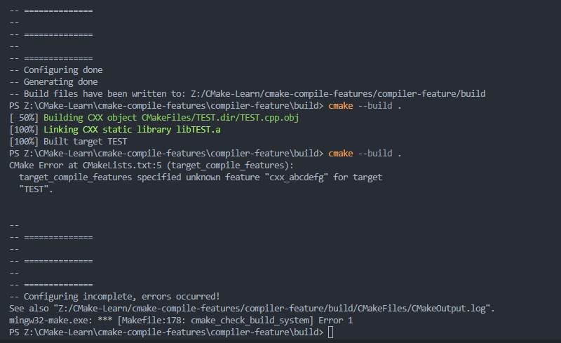

[toc]

#  cmake-compile-features
##  introduction
Project source code may depend on, or be conditional on, the availability of certain features of the compiler. there are three use-cases which arise: **Compile Feature Requirements, Optional Compile Features and Conditional Compilation Options**
While features are typically specified in programming language stanards, CMake provides a primary user interface based on granular handling of the features, not the language standard that introduced the feature.
The **CMAKE_C_KNOWN_FEATURES, CMAKE_CUDA_KNOWN_FEATURES, and CMAKE_CXX_KNOWN_FEATURES** global properties contain all the features known to CMake, regardless of compiler support for the feature. The **CMAKE_C_KNOWN_FEATURES, CMAKE_CUDA_KNOWN_FEATURES, and CMAKE_CXX_KNOWN_FEATURES** variables contain all features CMake knows are known to the compiler, regardless of language standard or compile flags needed to use them.
Features known to CMake are named mostly following the same convention as the Clang feature test macros. There are some exceptions, such as CMake using cxx_final and cxx_override instead of the single cxx_override_control used by Clang.
Note that there are no separate compile features properties or variables for the OBJC or OBJCXX languages. These are based of c or c++ respectively, so the properties and vaiables for their correspending base language should be used instead.

1) 有时我们在特定平台编写的代码是依赖于特定编译器的某些属性或者是某些语言特性的。如C98，C++11，C++20，MSVC，gcc，g++等。用户主要关注这三个属性：*项目的编译需求，可选编译选型，条件编译选项*
2) 虽然使用某种特性往往在语法的特殊性上就能明确，但CMake提供了直接且细节的特性变量。
3) CMake的内置全局变量包含了Cmake已知的全部编译特性，不管前编译器是否支持该特性。不管语言标准和编译标志等。
4) cmake中的这些变量一般都以一种简单的方式命名。
5) 需要注意的一点是，cmake没有为面向对象C或者是面向对象C++提供新的属性，因为他们的内在都是C和C++，所以没有做区分。

##  Compile Feature Requirements
- Compile feature requirements may be specified with the *target_compile_features()* command. For example, if a target must be compiled with compiler support for the *cxx_constexpr* feature:
```cmake{.line-numbers}
add_library(mylib required_constexpr.cpp)
target_compile_features(mylib PRIVATE cxx_constexpr)
```
- In processing the requirement for the cxx_constexpr feature, cmake will ensure that the in-use C++ compiler is capable of the feature, and will add any necessary flags such as -std=gun++11 to the compile lines of C++ files in the mylib target. A FATAL_ERROR is issued if the compiler is not capable of the feature.
- Such compile flags are added even if the compiler supports the particular feature without the flag. For example, the GNU compiler supports variadic templates (with a warning) even if -std=gun++98 is uesd. CMake adds the -std=gun++11 flag if cxx_variadic_templated is specified as a requirement.
- In the above example, mylib requires cxx_constexpr when it is built itself, buit consumers of mylib are not required to use a compiler which supports cxx_constexpr. if the interface of mylib does require the cxx_constexpr feature (or any other known feature), that may be specified with the PUBLIC or INTERFACE signatures of target_compile_features():
```cmake{.line-numbers}
add_library(mylib requires_constexpr.cpp)
#  cxx_constexpr is a usage-requirement
target_compile_features(mylib PUBLIC cxx_constexpr)

#  main.cpp will be compiled with -std=gun++11 on GUN for cxx_constexpr.
add_executable(myexe main.cpp)
target_link_libraries(myexe mylib)
```
- Feature requirements are evaluated transitively by consuming the link implementation. See cmake-buildsystem for more on transitive behavior of build properties and usage requirements.

1) 可以通过*target_compile_features()*命令来明确编译特性需求。
2) 在处理cxx_constexpr特性时，cmake将会确保编译该对象——mylib时的c++编译器具有该特性，同时会将与该特性有关的cxx编译选项添加到makefile脚本中。如果编译器不支持这个特性，cmake将会抛出一个致命的错误。
3) 使用cmake来对一项特性进行处理时，相关的编译指令都会被cmake加入到考虑的范围内，而非像普通的程序员一样只会添加单一的命令(cmake会添加依赖项)
4) 有的编译器中的一些特定属性本来就支持(编译器默认)，可是cmake还是会添加相应的编译指令
5) 注意各个target链接时是否需要具有同样的编译属性，可以通过public、private，interface等关键字来设置。
6) 特性与target的属性一样，通过链接来实现传递。


###  Requiring Language Standards
In projects that use a large number of commonly available features from a particular language standard(e.g. C++11) one may specify a meta-feature(e.g. cxx_std_11) that requires use of a compiler mode that is at minimum aware of that standard, but could be greater. This is simpler than specifying all the features individually, but does not guarantee the existence of any particular feature. Diagnosis of use of unsupported features will be delayed untill compile time.

For example, if C++ 11 features are used extensively in a project's header files, then clients must use a compiler mode that is no less than C++ 11. This can be requested with the code:
```cmake{.line-numbers}
target_compile_features(mylib PUBLIC cxx_std_11)
```

In this example, CMake will ensure the compiler is invoked in a mode of at-least C++ 11(or C++ 14, C++ 17, ...), adding flags such as -std=gun++11 if necessary. This applies to sources within mylib as well as any dependents(that may include headers from mylib).

1) 如果在一个项目中大量使用了某个语言标准(如C++11)，则应该使用CMake的编译器模式来声明编译器应该至少提供该特性标准，但是CMake只是规定了编译器标准的最低版本，并没有限制最高版本。这对于项目设置一个语言标准基础很容易，但是这只是使CMake生成了相应的Makefile脚本，具体编译器是否提供相应的支持将会在编译阶段进行检查。
2) 如果你的项目中使用了C++11的特性，可以通过上述CMake命令函数来显示指明。但是下述的代码CMake只是确保生成的Makefile中的编译指令最少是C++11(也有可能是C++14，C++17，C++20等)，如果必要的话，还会在Makefile中添加相应的编译指令。
```cmake{.line-numbers}
target_compile_features(mylib PUBLIC cxx_std_11)
```

###  Availability of COmpiler Extensions
The \<LANG\>\_EXTENSIONS target property defaults to the compiler's default(see CMAKE\_\<LANG\>\_EXTENSIONS_DEFAULT). Note that because most compilers enable extensions by default, this may expose portability bugs in user code or in the headers of third-party dependencies. 
\<LANG\>\_EXTENSIONS used to default to ON.

一般\<LANG\>\_EXTENSIONS对象的默认属性将会被设置为编译器的默认值。注意大部分的编译器都是默认能够扩展的，但是这样一般会在用户代码中或者是第三方头文件中暴露可移植性的漏洞。

##  Optional Compile Features
- Compile features may be preferred if available, without creating a hard requirement. This can be achieved by not specifying features with **target_compile_features()** and instead checking the compiler capabilities with preprocessor conditions in project code.
- In this use-case, the project may wish to establish a particular language standard if available from the compiler, and use preprocessor conditions to detect the features actually available. A language standard may be established by **Requiring Language Standards** using **target_compile_features()** with meta-features like cxx_std_11, or by setting the CXX_STANDARD target property or **CMAKE_CXX_STANDARD** variable.
- See also policy **CMP0120** and legacy documentation on **Example Usage** of the deprecated **WriteCompilerDetectionHeader** module.

1) 在能够使用编译特性时最好使用，因为使用编译特性不用创建很复杂的需求。可以不需要使用target_compile_features()命令来指明相应的特性，而是在整个项目的预处理阶段检查编译器是否支持相应的特性。
2) 用户在使用时，希望项目是建立在编译器支持语言特性的标准上，然后通过预处理就能知晓编译器是否支持当前的语言特性。一个语言标准的设置可以通过使用target_compile_features()来设置Requiring Language Standards的变换特性来实现，也可以通过设置CMAKE_CXX_STANDARD变量来实现。
- 这儿我有一个问题？如果在整个project中设置了CMAKE_CXX_STANDARD而在具体target中设置了不同的标准，CMake会采用哪一个呢？


##  Conditional COmpilation Option
Libraries may provide entirely different header files depending on requested compiler features.
For example, a header at with_variadics/interface.h may contain:
```c++{.line-numbers}
template <int I, int ... Is>
struct Interface;

template <int I>
struct Interface<I>
{
    static int accumulate()
    {
        return I;
    }
};

template <int I, int ... Is>
struct Interface
{
    static int accumulate()
    {
        return I + Interface<Is...>::accumulate();
    }
};
```
while a header at no_variadics/interface.h may contain:
```c++{.line-numbers}
template <int I1, int I2 = 0, int I3 = 0, int I4 = 0>
struct Interface
{
    static int accumulate() { return I1 + I2 + I3 + I4; }
};
```
it may be possible to write an abstraction interface.h header containing something like:
```c++{.line-numbers}
#ifdef HAVE_CXX_VARIADIC_TEMPLATES
#include "with_variadics/interface.h"
#else
#include "no_variadics/interface.h"
#endif
```
However this could be unmaintainable if there are many files to abstract. What is needed is to use alternative include directories depending on the compiler capabilities.

CMake provides a *COMPILE_FEATURES* **generator expression** to implement such conditions. This may be used with the build-property commands such as **target_include_directories()** and **target_link_libraries()** to set the appropriate **buildsystem** properties:
```cmake{.line-numbers}
add_library(foo INTERFACE)
set(with_variadics ${CMAKE_CURRENT_SOURCE_DIR}/with_variadics)
set(no_variadics ${CMAKE_CURRENT_SOURCE_DIR}/no_variadics)

target_include_directories(foo
    INTERFACE
    "$<$<COMPILE_FEATURES:cxx_variadic_template>:${with_variadics}>"
    "$<$<NOT:$<COMPILE_FEATURES:cxx_variadic_templates>>:${no_variadics}>"
)
```
Consuming code then simply links to the foo target as usual and uses the feature-appropriate include directory
```cmake{.line-numbers}
add_executable(consumer_with consumer_with.cpp)
target_link_libraries(consumer_with foo)
set_property(TARGET consumer_with CXX_STANDARD 11)

add_executable(consumer_no consumer_no.cpp)
target_link_libraries(consumer_no foo)
```

有关项目经验的可能清楚：有时我们在编译库文件和使用库文件，以及将库文件链接到其它的可执行文件中去时，它们依赖的头文件可能完全不同。这是就可以通过设置编译特性来将它们区分开来。
对于上述的情况，一种处理方式是使用一个公共头文件，在该头文件中定义相应的宏开关开控制实际引入的是哪个头文件，但是存在一个问题，公共头文件又对实际上的头文件进行了封装，导致它们之间的维护和修改都变得非常复杂。**另一种推荐的做法是使用编译选项与生成表达式的组合来实现，这样引用与调用之间的关系更加直接，它们可以直接在target_include_directories()和target_link_libraries()中使用————最常见的存在分歧的就是头文件与链接的对象文件**

- 将存在差异的头文件定位，并且设置为CMake中的两个变量
- 在引用中时，使用生成表达式来判断编译器的某一特性是否存在，存在就选择相应的头文件变量的路径
- 在链接时，我们只需要在target的property中设置相应的编译器选项即可
